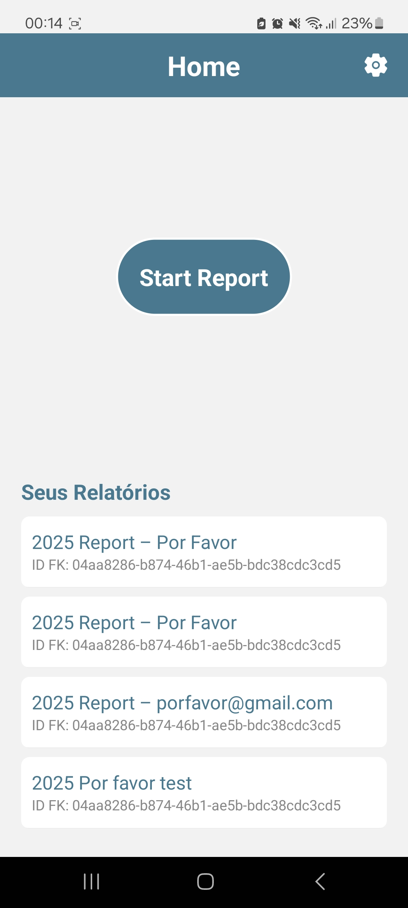
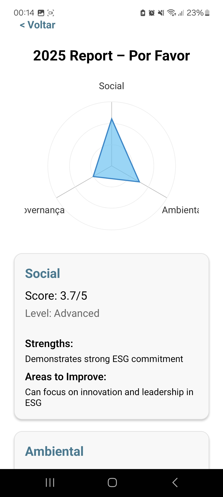

# Tema - Objetivo

No contexto do padrão da ESG, "Environmental, Social and Governance" (Ambiental, Social e Governança). Nosso objetivo é facilitar o processo de autoavaliação de pequenas e médias empresas na geração de seu **Relatório** de transparencia.

### Entrega 1

- Apresentação e Pitch do tema.
- Visão geral da solução.

### Entrega 2

- Versão 1 - Esqueleto do projeto.

### Entrega 3

- Versão 2 - Adicao do Gráfico teia + Design de interface.

### Entrega Final

- Versão 3 - Reports Salvos repectifivamente no perfil logado.

  
  
  
  

_______________

## Requisitos:
- Login - Autenticação da Empresa - OK
- Perguntas dentro do template - OK
- Pesos nas Respostas - OK
- Gerar Gráfico teia - OK
- Salvar Report referente ao seu ano - OK
- Visualização de Relatórios por login - OK
- Exportar o relatório(pdf, envio via email) - X (RESSALVA DO CLIENTE)

# Baixe aqui

Link: https://expo.dev/accounts/rafaelsampa/projects/snack-387ee25a-de82-4601-8c77-cf458caae4df/builds/dcad40ee-edd0-4fff-a28e-ea22b9d9a484

  

# Integrantes
- Rafael Sampaio e Silva
- Arthur Felipe Leite de Vasconcelos
- Gabriel Martins de Souza

<table>
  <tbody>
    <tr>
      <td align="center"><a href="https://github.com/ArthurFunicap"> Arthur felipe</a></td>
      <td align="center"><a href="https://github.com/gmartinsouza"> Gabriel Martins</a></td>
      <td align="center"><a href="https://github.com/rafaelsampa"> Rafael Sampaio</a></td>
    </tr>
  </tbody>
</table>
